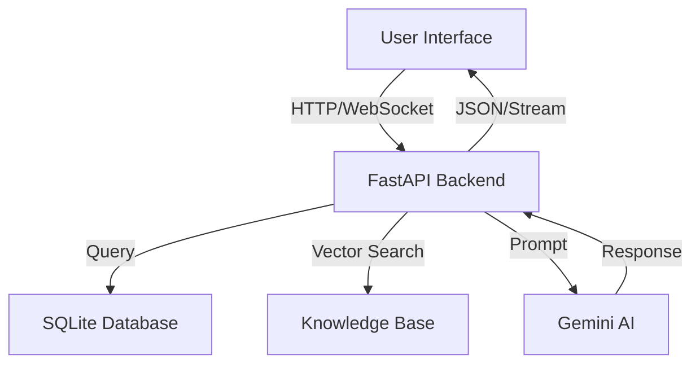

# 🌌 AURA (Advanced User Reactive Assistant)

[](https://fastapi.tiangolo.com/)
[](https://ai.google.dev/)
[](LICENSE)
[](https://www.python.org/)

**AURA** is a next-generation, AI-powered personal productivity assistant designed to seamlessly integrate chat, task management, scheduling, and knowledge retrieval into a single, cohesive interface. Built with a "dark-mode first" philosophy, it offers a premium, glassmorphism-inspired UI that feels alive and responsive.

---

## ✨ Key Features

### 💬 Intelligent Chat Interface
- **Context-Aware AI**: Powered by Google Gemini for natural, context-rich conversations.
- **Markdown & Code Support**: Beautiful rendering of code blocks, tables, and formatted text.
- **Real-time Streaming**: Instant responses with typing indicators and smooth animations.
- **Memory & Context**: Remembers previous interactions for a continuous dialogue flow.

### 📋 Kanban Task Management
- **Visual Board**: Drag-and-drop Kanban board (To Do, In Progress, Done).
- **Smart Categorization**: Auto-tagging and prioritization of tasks.
- **Detailed Cards**: Rich task details including due dates, priority badges, and descriptions.
- **Seamless Integration**: Create tasks directly from chat conversations.

### 📅 Dynamic Calendar & Scheduling
- **Daily Timeline View**: Precision daily planner with a vertical timeline layout.
- **Magic Schedule**: AI-powered auto-scheduling that optimizes your day based on tasks and priorities.
- **Event Management**: Visual distinction between tasks, meetings, breaks, and deep work blocks.
- **Time Blocking**: Drag-and-drop time allocation for focused productivity.

### 🧠 Knowledge Base (RAG)
- **Document Ingestion**: Upload and index documents (PDF, TXT, MD) for AI retrieval.
- **Semantic Search**: Ask questions about your uploaded documents.
- **Contextual Answers**: The AI cites sources and uses your knowledge base to answer queries.

### 📊 Insights & Analytics
- **Focus Score**: Real-time productivity tracking and focus metrics.
- **Activity Trends**: Visual charts showing task completion and productivity over time.
- **Productivity Distribution**: Analysis of time spent on different categories (Work, Learning, Health).

---

## 🛠 Technology Stack

| Component | Technologies |
|-----------|--------------|
| **Backend API** | FastAPI, Uvicorn, SQLAlchemy, Pydantic |
| **AI Engine** | Google Gemini 2.0 Flash, LangChain (RAG) |
| **Database** | SQLite (Local), Vector Store (ChromaDB/FAISS) |
| **Frontend** | HTML5, Vanilla CSS (Glassmorphism), JavaScript (ES6+) |
| **Visualization** | Chart.js, Lucide Icons |
| **Deployment** | Docker (Optional), Python-dotenv |

---

## 🚀 Quick Start

### Prerequisites
- Python 3.10+
- Google Gemini API Key
- Modern Web Browser

### Installation

1. **Clone the Repository**
```bash
git clone https://github.com/your-username/aura-assistant.git
cd aura-assistant
```

2. **Set Up Environment**
```bash
# Create virtual environment
python -m venv venv
source venv/bin/activate  # Linux/Mac
# or
venv\Scripts\activate    # Windows

# Install dependencies
pip install -r requirements.txt
```

3. **Configure Environment Variables**
Create a `.env` file in the root directory:
```env
GEMINI_API_KEY=your_gemini_api_key_here
DATABASE_URL=sqlite:///./aura.db
```

4. **Start the Backend Server**
```bash
python backend/run_backend.py
# Server will start at http://localhost:8000
```

5. **Launch the Application**
Open `frontend/index.html` in your browser or serve it using a simple HTTP server:
```bash
cd frontend
python -m http.server 3000
# Access at http://localhost:3000
```

---

## 📁 Project Structure

```
AURA/
├── backend/
│   ├── app/
│   │   ├── main.py                 # FastAPI entry point
│   │   ├── models/                 # Database models
│   │   ├── routes/                 # API endpoints (chat, tasks, schedule)
│   │   ├── services/               # Business logic (AI, RAG, Calendar)
│   │   └── utils/                  # Helper functions
│   └── run_backend.py              # Server runner script
├── frontend/
│   ├── css/
│   │   └── styles.css              # Global styles & Glassmorphism theme
│   ├── js/
│   │   ├── main.js                 # Core frontend logic
│   │   ├── chat.js                 # Chat handling
│   │   ├── tasks.js                # Kanban board logic
│   │   └── calendar.js             # Timeline view logic
│   └── index.html                  # Main application entry
├── data/                           # Local database and vector store
├── requirements.txt                # Python dependencies
└── README.md
```

---

## 🔄 Workflow

### System Architecture


### Magic Schedule Flow
1. **Task Collection**: Aggregates pending tasks from the Kanban board.
2. **Constraint Analysis**: Checks existing calendar events and user preferences.
3. **AI Optimization**: Gemini generates an optimal schedule.
4. **Allocation**: Tasks are assigned specific time slots in the database.
5. **Visualization**: The Calendar view updates in real-time.

---

## 🔌 API Endpoints

### `POST /api/chat`
Send a message to the AI assistant.
```json
{
  "message": "Plan my day based on my tasks",
  "context": "..."
}
```

### `GET /api/tasks`
Retrieve all tasks for the Kanban board.

### `POST /api/schedule/auto-assign`
Trigger the Magic Schedule algorithm to organize your day.

---

## 👥 Development Team

| Team Member | Role | GitHub |
|-------------|------|--------|
| **Rakshak D** | Lead Developer | [@Rakshak-D](https://github.com/Rakshak-D) |

---

## 📄 License

This project is licensed under the MIT License - see the [LICENSE](LICENSE) file for details.

---

## 🔮 Future Roadmap

- [ ] **Voice Interface**: Full STT/TTS integration for hands-free operation.
- [ ] **Mobile App**: React Native mobile application.
- [ ] **Plugin System**: Allow third-party integrations (Spotify, Notion, etc.).
- [ ] **Multi-User Support**: Collaborative workspaces and shared calendars.

---

**Experience the future of productivity with AURA. 🌌**
